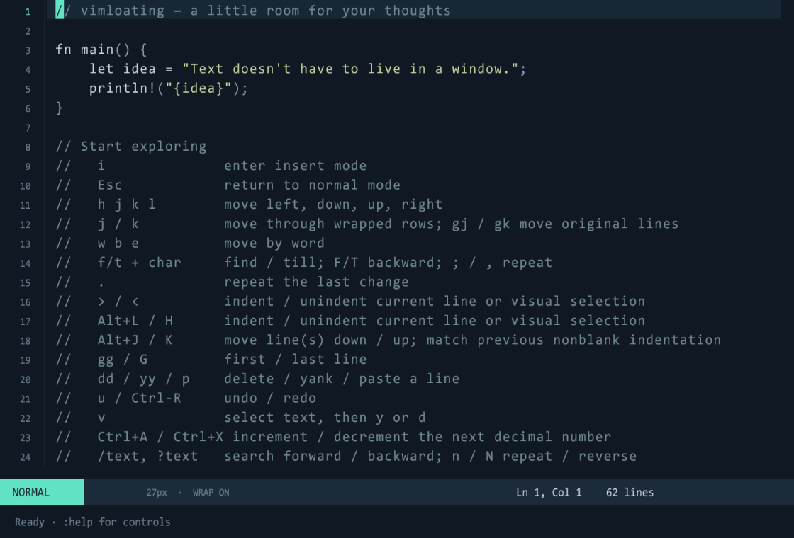

# vimloating

A Rust text editor on a floating surface in 3D space, inspired by Kashikishi. A perspective grid, a straight-on text panel, and smoothly interpolated camera motion give you a spatial workspace. Rendering uses **OpenGL through Macroquad / Miniquad**.



## Run

Install a current stable Rust toolchain and run:

```sh
cargo run --release
```

Open an existing UTF-8 file, or start a new file at a given path:

```sh
cargo run --release -- notes.rs
```

The app runs as a native desktop window on Windows, Linux, and macOS. It needs an OpenGL-capable graphics driver. Linux additionally needs the usual X11/OpenGL development packages; on Debian/Ubuntu these are `libx11-dev`, `libxi-dev`, and `libgl1-mesa-dev`.

Running without a filename opens an editable introduction buffer. Save it under a name with `:w notes.rs`, or open another file with `:e path`.

The desktop command accepts one file or directory and an optional screenshot destination:

```text
vimloating [--screenshot output.png] [--] [file or directory]
```

Pass a directory (for example, `cargo run --release -- .`) to start in the file browser. Use `--help` or `-h` to print usage without opening a window. Unknown options, extra paths, and missing screenshot destinations report an error and exit with a nonzero status. The screenshot option can appear before or after the file or directory.

Use `--` before a filename starting with `-`; when using Cargo, its own `--` comes first:

```sh
cargo run --release -- -- -notes.rs
cargo run --release -- "docs/my notes.rs" --screenshot preview.png
```

For a screenshot destination starting with `-`, use an explicit relative path such as `./-preview.png`. `--screenshot` may be specified once and captures a frame before exiting.

## Terminal editor

Run the editor directly in your terminal, with no window or OpenGL dependency:

```sh
cargo run --release --no-default-features --features tui --bin vimloating-tui
cargo run --release --no-default-features --features tui --bin vimloating-tui -- notes.rs
```

Pass a directory to start in the file browser. A missing file opens a new empty buffer. Use `--help` for CLI usage, `F1` for terminal controls, and `:q`, `:q!`, or `:wq` to exit.

The TUI shares the desktop editor's Vim motions, counts, insert/visual modes, text objects and operators, block selections, marks, indentation folds, yank feedback, command/search history windows, undo/redo, live search highlights, character-find hints, buffers, file commands, directory browser, shell commands, themes, and unsaved-change protection. It includes line numbers, syntax colors, wrapping, a status line, and a command/search prompt. Terminal resizing updates the viewport. In shell output, buffer lists, and F1 help, use `j`/`k`, arrows, PageUp/PageDown, or Home/End to scroll; Esc returns to editing.

Use your terminal's paste shortcut in Insert mode. On terminals that report bracketed-paste events, multiline text is inserted literally without interpreting it as editor commands. Windows console paste may arrive as individual keys, with the same auto-indentation as typing. Terminal fonts and clipboard access are managed by the terminal. Some terminals encode Ctrl+H as Backspace and Ctrl+J as Enter, or reserve Ctrl+S; those shortcuts depend on your terminal's settings. In terminal Insert mode, Ctrl+H deletes the previous character, Ctrl+I inserts four spaces, and Ctrl+J/M insert an auto-indented newline. The editor uses one cell per Unicode character: tabs display as `→`, while wide, zero-width, and control characters display as `�` to keep cursor positions aligned. Their original contents are preserved when saved.

The [configuration file](#configuration) supplies the startup theme for both frontends. Both frontends can be built together with `cargo build --release --all-features`.

## Configuration

Create a UTF-8 file named `.vimfloating` in your home directory:

- Windows: `%USERPROFILE%\.vimfloating`, typically `C:\Users\YourName\.vimfloating`.
- Linux/macOS: `$HOME/.vimfloating`, also written as `~/.vimfloating`.

The editor checks `USERPROFILE` first, then `HOME` if `USERPROFILE` is unset. Both frontends read the file once at startup; restart the editor after changing it.

Use one `key=value` setting per line, without quotes or section headers. For example, this selects Everforest and starts the desktop frontend in 3D flat-only mode:

```ini
theme=everforest
2d_only=false
```

| Setting | Values | Default | Applies to |
| --- | --- | --- | --- |
| `theme` | `default` (alias `vimfloating`), `everforest`, or `solarized-blue` (aliases `solarized-dark-blue` and `solarized`) | `default` | Desktop and TUI |
| `2d_only` | `true` or `false` | `true` | Desktop; ignored by the TUI |

`2d_only=true` fills the viewport with the editor and disables camera movement. With `false`, the editor starts on a floating surface facing you; press `F4` to enable orbit mode. `F5` toggles 2D-only mode during the session.

Keys are case-sensitive; theme names are case-insensitive, and booleans must be lowercase. Spaces around keys and values are allowed. Blank lines, lines without `=`, and unknown keys are ignored. Missing or invalid settings use their defaults; if a key appears more than once, its last value is used. A missing or unreadable file also uses the defaults.

Use `:theme` to show the current theme or `:theme everforest`, `:theme solarized-blue`, or `:theme default` to change it during the session. Theme commands and camera toggles do not write back to `.vimfloating`; edit the file to change startup preferences.

## Move through space

| Input | Action |
| --- | --- |
| Mouse wheel / trackpad scroll | Smoothly zoom in and out |
| Right-button drag | Pan when started outside the editor; orbit from the surface when flat-only mode is disabled |
| Middle-button drag | Pan the camera |
| Left click on text | Position the cursor, then highlight and underline the clicked character, including while tilted or zoomed |
| `F2` | Smoothly return to the home view |
| `F1` | Show/hide the camera-controls overlay |
| `F3` | Toggle the perspective floor grid (off at startup) |
| `F4` | Toggle flat-only/orbit in 3D; from 2D-only, enter orbit mode |
| `F5` | Toggle 2D-only mode (on by default); fills the viewport and disables camera movement |

The text is rendered into an offscreen OpenGL texture at 2× the window's physical pixel width (with a 3200-pixel minimum), recreated when the viewport or display scale changes. Mipmaps are refreshed after drawing each frame, with trilinear filtering and a small bias toward finer levels to keep zoomed-out text sharp while smoothing zoom transitions. In 2D-only mode (enabled by default), that texture fills the viewport and camera movement is disabled; press `F5` to toggle it off or on. `F4` keeps its flat-only/orbit behavior in 3D, and exits 2D-only directly into orbit mode. Flat-only mode keeps the surface facing you and hides the scene frame and HUD. The floor grid starts hidden and can be shown with `F3`. Wheel zoom is deliberately gentle, and camera motion uses frame-rate-independent exponential smoothing. Mouse positioning uses a ray/plane intersection, so it continues to work when the surface is rotated.

In 3D mode, moving the cursor within 24 pixels of a viewport edge or beyond it makes the camera smoothly pan to center the cursor. This also works in flat-only mode. In 2D-only mode, the editor scrolls to keep the cursor visible without moving the camera.

## Vim controls

Start in **Normal** mode. `Esc` returns to Normal from any mode.
The default `<leader>` key is `Space`.

| Input | Action |
| --- | --- |
| `h` / `l`, Left / Right | Move left / right |
| `j` / `k` | Move down / up through wrapped display rows; counts supported |
| `gj` / `gk`, Down / Up | Move down / up through original text lines; counts supported |
| `Ctrl+N` / `Ctrl+P` | Next / previous line in Normal or Visual mode; next / previous matching history entry in command and search prompts |
| `Home` / `End` | Move to line start / line end |
| `w` `b` `e` | Next word / previous word / word end |
| `ge` | End of the previous word, across lines; counts supported |
| `f{char}` / `F{char}` | Find next / previous matching character on the line; pressing `f` / `F` highlights and underlines a suggested letter in every following / previous word |
| `t{char}` / `T{char}` | Move just before / after the next / previous matching character; `t` / `T` show the same word-target hints |
| `;` / `,` | Repeat the last character find in the same / opposite direction |
| `{` / `}` | Previous / next paragraph |
| `(` / `)` | Previous / next sentence |
| `%` | Jump between matching (), [] or {} delimiters, across lines; ignores quoted text and C-style comments |
| `0` `^` `$` | Line start / first nonblank / line end |
| `H` / `M` / `L` | First nonblank on the top / middle / bottom visible line |
| `gg` / `G` | First / last line |
| `gf` / `gF` | Open the file path under the cursor in a buffer; `path:line` and `path:line:column` jump to that address |
| `m{letter}` / `` `{letter} `` / `'{letter}` | Set a buffer-local mark / jump to its position / jump to its first nonblank |
| `12G` or `:12` | Go to line 12 |
| `i` / `a` | Insert before / after the cursor |
| `I` / `A` | Insert at first nonblank / line end |
| `o` / `O` | Open a line below / above, preserving indentation |
| `x` / `X` / `D` | Delete under cursor / before cursor / to end of line |
| `Backspace` | Move back one character without deleting in Normal or Visual mode; in Insert mode, delete the previous character or join with the previous line at line start; hold to repeat |
| `Delete` in Insert mode | Delete under the cursor; hold to repeat |
| `r{char}` | Replace characters under the cursor (with counts) or throughout a Visual selection; Enter replaces with a line break |
| `~` / `g~~` | Toggle case of characters / whole lines (with counts), or the Visual selection; supports Unicode, undo and repeat |
| `guu` / `gUU`, `gu` / `gU` in Visual mode | Lowercase / uppercase whole lines (with counts) or the selection |
| `dd` / `yy` | Delete / yank a line |
| `diw` / `daw`, `yiw` / `yaw` | Delete / yank inner or around words directly in Normal mode; d/y also work with the other text objects below, with counts |
| `guiw` / `gUiw` / `g~iw`, `guaw` / `gUaw` / `g~aw` | Lowercase / uppercase / toggle case of inner or around text objects; all objects below work with v, d, y, gu, gU and g~, with counts; edits support undo and `.` repeat |
| `p` / `P` | Paste after / before from the internal register |
| `v` / `V`, then movement | Select characters / whole lines |
| `Ctrl+V` in Normal or Visual mode | Select a rectangular block; movement extends it, y/d/r copy/delete/replace it, p/P paste blocks in columns |
| `iw` / `aw`, `iW` / `aW` in Visual mode | Select inner / around a word or whitespace-separated WORD; counts select several words |
| `ib` / `ab`, `iB` / `aB`, `i[` / `a[`, `i<` / `a<` in Visual mode | Select inner / around (), {}, [] or <> blocks; repeats expand to enclosing blocks |
| `i"` / `a"`, `i'` / `a'`, `` i` `` / `` a` ``, `it` / `at` in Visual mode | Select inner / around quotes or nested tags |
| `ip` / `ap`, `is` / `as` in Visual mode | Select inner / around a paragraph or sentence |
| `Ctrl+A` / `Ctrl+X` in Normal mode | Increment / decrement the decimal number at or after the cursor |
| `o` in Visual mode | Switch the active end of the selection |
| `d` / `x` / `y` in Visual mode | Delete / delete / yank the selection; line selections paste as lines |
| `<` / `>` | Unindent / indent the current line, or every selected line in Visual mode |
| `Alt+H` / `Alt+L` | Unindent / indent the current line, or every selected line in Visual mode |
| `Alt+J` / `Alt+K` | Move the current line (or the selected lines) down / up, re-indenting to match |
| `zz` | Center the cursor line in the view |
| `zc` / `zo` / `za` / `zM` / `zR` | Close / open / toggle an indentation fold / close all / open all; edits open folds |
| `u` / `Ctrl+R` | Undo / redo |
| `.` | Repeat the last change |
| `Ctrl+C` | Return to Normal; from a history window, transfer its selected line to the prompt |
| `q:` / `q/` (also `q\`) inside Command mode | Edit command / search history with Vim keys after entering `:`; Enter executes the selected line, Ctrl+C transfers it to the prompt, Esc closes |
| `/pattern` / `?pattern`, `Enter` | Search forward / backward for literal, case-sensitive text with live highlights and wraparound |
| `n` / `N` | Repeat in the last search direction / opposite direction |
| `*` / `#` | Search forward / backward for the complete word under or after the cursor; counts and n/N repeat with wraparound |
| `Ctrl+6` | Toggle to the last active buffer |
| `<leader><leader>` | Toggle to the last active buffer |
| `<leader>e` | Browse the current file's directory (or the working directory) |
| `:Files` / `:Gfiles` / `:Gfiles?` | Fuzzy-pick files from `rg --files`, Git, or Git status |
| `:Buffer` / `:Blines` / `:Lines` | Pick a buffer, a line from any buffer, or a line in the active buffer |
| `:Marks` / `:History` | Pick a marked line or a recently opened file |
| `:History:` / `:History/` | Pick a command or search history entry |
| `:Command` / `:Help` | Pick an editor command or README topic |

In pickers, type to filter, use Up/Down or Ctrl+N/P to move, and Enter or Ctrl+J/M to select.
| `Ctrl+E` / `Ctrl+Y` | Scroll down / up one display line |
| `Ctrl+D` / `Ctrl+U` | Scroll down / up half a page, then center the view |
| `Ctrl+F` / `Ctrl+B` | Scroll down / up one page, then center the view |
| `Ctrl+J` / `Ctrl+K` | Desktop: animate through five lines down / up; TUI: scroll five display lines down / up, keeping the cursor visible |
| `PageDown` / `PageUp` | Move a page down / up |
| `Ctrl+S` | Save to the current filename |
| `Ctrl+V` in Insert mode | Paste system clipboard text |
| `Ctrl+X`, then `Ctrl+F` in Insert mode | Complete a filename or directory path; use `Ctrl+N` / `Ctrl+P` to cycle matches |
| `Ctrl+N` / `Ctrl+P` in Insert mode | Complete a word from the current buffer, or cycle forward / backward through matches of the active completion type |
| `Ctrl+X`, then `Ctrl+N` / `Ctrl+P` in Insert mode | Start word completion explicitly |
| `Ctrl+X`, then `Ctrl+L` in Insert mode | Complete a whole line from the current buffer, preserving the current indentation; `Ctrl+L` or `Ctrl+N` / `Ctrl+P` cycle matches |
| `Ctrl+W` / `Ctrl+Backspace` in Insert mode | Delete the previous word |
| `Ctrl+-` / `Ctrl+=` | Decrease / increase font size |

Counts work with movements and common operations, such as `5j`, `3w`, `2dd`, `4yy`, and `2p`. Each Insert session is one undo step. In Insert mode, Enter auto-indents, Tab inserts four spaces, Backspace deletes the previous character and joins adjacent lines at line start, and Delete joins adjacent lines when at line end. In Normal or Visual mode, Backspace at line start moves to the end of the previous line. Prompt Backspace deletes the previous character. After 15 seconds without keyboard, pointer, mouse-button, or scroll activity, Insert mode automatically returns to Normal. Vertical scroll keys keep the cursor visible, and can scroll past the end until only the final display line remains visible.

Insert path completion and `gf` resolve relative paths from the current file's directory, or the working directory for an unnamed buffer. `gf` also checks the working directory if the file is not found beside the current file. Absolute paths and `~/` paths work too. Quote filenames that contain spaces in buffer text, such as `"docs/my notes.txt"`; an address can follow the closing quote (`"docs/my notes.txt":12:3`). Line and column numbers start at 1. Opening a path keeps unsaved buffers in memory. Completion appends a separator to directories; press `Ctrl+X Ctrl+F` again to complete their contents. Completion is part of the Insert session's undo and `.` repeat.

Word completion matches the word prefix before the cursor using letters, numbers, and underscores, including Unicode. Whole-line completion matches text from the first nonblank character to the cursor against other lines, keeping your indentation and any text after the cursor. Buffer completions are case-sensitive and deduplicated. Typing, moving the cursor, or leaving Insert mode resets the cycle; use `Ctrl+X` followed by `Ctrl+N`/`Ctrl+P`, `Ctrl+L`, or `Ctrl+F` to select another completion type.

Completion shows a popup beside the cursor with the current match highlighted and its position in the list. The popup scrolls through up to eight visible matches and moves above the cursor near the bottom of the viewport. Command-mode Tab completion also shows its matches above the prompt. Typing keeps the inserted match and dismisses the popup; Esc returns to Normal mode.

Hold `Ctrl+N` / `Ctrl+P` to cycle completion matches, move through lines, or browse prompt history. Desktop arrows, Home/End, page keys, scrolling shortcuts, Backspace, Insert-mode Delete/Tab/Enter and word deletion, command Tab, font-size shortcuts, and Alt movement/indent shortcuts also repeat. Repeat starts after 350 ms and continues every 60 ms, stopping when the key is released; Ctrl shortcuts stop when Ctrl is released. Ordinary typed characters and Vim letter commands use operating-system repeat events. Insert edits stay part of the session's undo and `.` repeat. Terminal repeat timing follows your terminal or operating system.

Character-find hints prefer the letter in each word requiring the fewest `;` repeats to reach; ties favor letters that occur less often in that word.

Word wrap is on by default. Wrapped continuation rows start four spaces beyond the original line's leading whitespace; this is display padding and does not modify the file. Press Enter twice quickly in Normal mode to toggle wrapping. `Ctrl+H` / `Ctrl+L` scroll the text horizontally; using either shortcut turns wrapping off so long lines can be scrolled. Font size can be adjusted from 12–42 px with the Ctrl+-/= shortcuts.

### Search

Both frontends search for literal, case-sensitive text. For example, `/foo` matches `foo` within `foobar`, but not `Foo`; `/foo.*` matches the exact text `foo.*`. Regular expressions, Vim pattern escapes, and matches spanning line breaks are not supported. Unicode characters and spaces are matched as entered.

Matches highlight as you type; Enter jumps to the next match in the chosen direction, wrapping at the file boundary. Enter with an empty `/` or `?` prompt reuses the previous search. `n` repeats in the last search direction, `N` reverses it, and counts such as `3n` advance through several matches. Esc cancels the prompt and retains the previous search.

`*` and `#` search for the complete word under or after the cursor, forward or backward. Words consist of letters, numbers, and underscores, including Unicode; these searches match whole words rather than substrings, and `n` / `N` retain that behavior. `:noh` / `:nohlsearch` clears both highlighting and the stored pattern, so repeating a search requires entering a new pattern or using `*` / `#` again.

### Commands

Type `:`, enter a command, and press Enter. Press Tab to complete command names or file paths for `:e`, `:e!`, `:w`, `:wq`, `:x`, `:Ex`, and `:Explore`; repeated Tab cycles through matches. Command paths are relative to the working directory and support `~/`. Paths can contain spaces; enter them directly without quotes.

| Command | Action |
| --- | --- |
| `:120` | Jump to the first nonblank on line 120, revealing folds; numbers beyond the file end land on its last line |
| `:w` | Save |
| `:w path/to/file` | Save under a filename |
| `:e path/to/file` | Open a file in another buffer; keep unsaved edits in the current buffer |
| `:e! path/to/file` | Replace the current buffer, discarding unsaved changes |
| `:Explore` / `:Ex [directory]` | Browse a directory; use `j`/`k`, Enter to open, and `-` for the parent |
| `:!command` | Run a command in the current file's directory and show captured output; press Esc to return |
| `:.!command` | Feed the current line to a command and replace it with the command's output |
| `:theme everforest` | Switch to the Everforest dark palette |
| `:theme solarized-blue` | Switch to the blue Solarized Dark palette |
| `:theme default` | Restore the Vimfloating palette |
| `:ls` / `:buffers` / `:b` / `:buffer` | Show the buffer list; press Esc to return |
| `:b {id or name}` / `:buffer {id or name}` | Switch to a buffer by its list ID, filename, or unique filename prefix |
| `:bn` / `:bp` / `:bnext` / `:bprevious` | Switch to the next / previous buffer; modified buffers stay open in memory |
| `:bd [id or name]` / `:bdelete [id or name]` | Delete the specified buffer, or the current buffer when omitted; use `:bd!` / `:bdelete!` with the same optional target to discard unsaved changes |
| `:b delete` / `:b delete!` | Delete the current buffer / discard its unsaved changes and delete it |
| `:q` | Quit if there are no unsaved changes |
| `:q!` | Quit and discard changes |
| `:wq [path/to/file]` / `:x [path/to/file]` | Save and quit; an optional path saves under that filename |
| `:noh` / `:nohlsearch` | Clear search highlighting and the stored pattern |
| `:help` | Show a compact bindings reminder |

Buffer IDs are shown by `:ls`. Buffer names match the full path or just the filename, case-insensitively; use a unique prefix if you do not enter the whole name. For example, `:b notes` switches to `notes.rs` when it is the only matching buffer, and `:bd 2` deletes buffer 2. Deleting a buffer keeps its file on disk. Deleting the last buffer leaves an empty editable buffer.

Closing the window also checks for unsaved changes; use `:wq` or `:q!` when needed. Quit protection checks every open buffer, so `:wq` / `:x` can save the current buffer and still refuse to exit if another buffer has unsaved changes.

## Scope

This is a working multi-buffer prototype with a useful subset of Vim controls. It includes lightweight comment/string coloring, character-indexed Unicode editing, a bounded undo history, and UTF-8 file I/O. It does not implement Vim's full operator/motion grammar, plugins, LSP, or multiple floating documents.

Files are normalized to LF line endings when opened. Existing tab characters are preserved and displayed as a single arrow cell. Text uses an installed monospace font (Consolas, Menlo, DejaVu Sans Mono, or Liberation Mono), falling back to Macroquad's built-in font; available glyphs depend on the font.

## TODO

General:
- [ ] Add `gi`.
- [ ] Add `Ctrl+I`.
- [ ] Add `Ctrl+O`.
- Use leader and localleader key for something
- Add vim submode
- Selection based command mode
  - Find
  - Replace
  - Delete
- Insert mode control
  - Go to beginning
  - Go to end
  - Move between words
  - Enter
  - New line before/after
  - Delete/Backspace
  - Move between char
  - Indent/deindent
  - Copy/Cut/Paste
  - Move between lines
- Tab and window navigation
- FZF features

Code editor:
- More Vim options
- Quickfixlist
- Fuzzy finder / command palette
  - FZF/telescope/harpoon like?
- Outline
- LSP support
- Code Completion
- Hover
- Tree-sitter support

Renderer feature:
- Make 3D feature optional in canvas mode
- 3D control with keyboard
- Full screen mode
- Goyo + Limelight mode
- Walk around mode
- Popup mode
- Full canvas support
- Arrow/rope connector

## Done

- Word, line, and file/path completion in Insert mode; path completion in Command mode; `gf` / `gF` open file addresses under the cursor
- TUI mode (optional terminal frontend)
- CLI command for TUI mode
- Marks (buffer-local letter marks)
- Indentation folds (replaceable fold provider for future Tree-sitter support)
- Ctrl+N / Ctrl+P line movement and command/search history
- Command mode shortcuts: Ctrl+C, q:, q/
- Replace with r
- Move between block delimiters with %
- Select text blocks with inner/around Visual text objects
- Visual feedback when yanking (copied area blinks briefly)
- Ctrl+V block selection
- Toggle case with ~ and g~~
- Upper/lower case with guu and gUU
- Next/previous word under cursor with * and #
- Go to a line with :120

## Development

```sh
cargo test
cargo clippy --all-targets -- -D warnings
cargo build --release
```

Verify the standalone terminal build:

```sh
cargo test --no-default-features --features tui
cargo clippy --no-default-features --features tui --all-targets -- -D warnings
cargo build --release --no-default-features --features tui --bin vimloating-tui
```

For a native OpenGL rendering smoke test, capture a frame and exit:

```sh
cargo run -- --screenshot preview.png
```

- `src/main.rs`: desktop binary entry point.
- `src/lib.rs`: shared editor and configuration library, plus the optional TUI frontend.
- `src/config/`: renderer/editor constants, themes, startup settings, and the welcome buffer.
- `src/editor/`: buffer state and core methods, editing, motions, text objects, registers, repeat playback, search, file I/O, Ex commands, shell execution, and viewport layout.
- `src/desktop/`: desktop startup/event loop, CLI argument parsing, and camera controls.
- `src/desktop/input/`: keyboard dispatch, key repeat, and animated movement.
- `src/desktop/render/`: editor-surface rendering, text primitives, layout, completion popups, search highlights, and the 3D scene.
- `src/tui/`: terminal session lifecycle, input, help text, and rendering.
- `src/bin/vimloating-tui.rs`: terminal binary entry point and CLI.
- `tests/unit/`: configuration, editor, desktop, and TUI tests grouped by component and behavior. These are attached to their source modules with `#[cfg(test)]` and `#[path]`, preserving access to private code.
- `tests/integration/`: executable tests for desktop help, argument errors, and file-open errors; registered as the `desktop_cli` test target in `Cargo.toml`.
